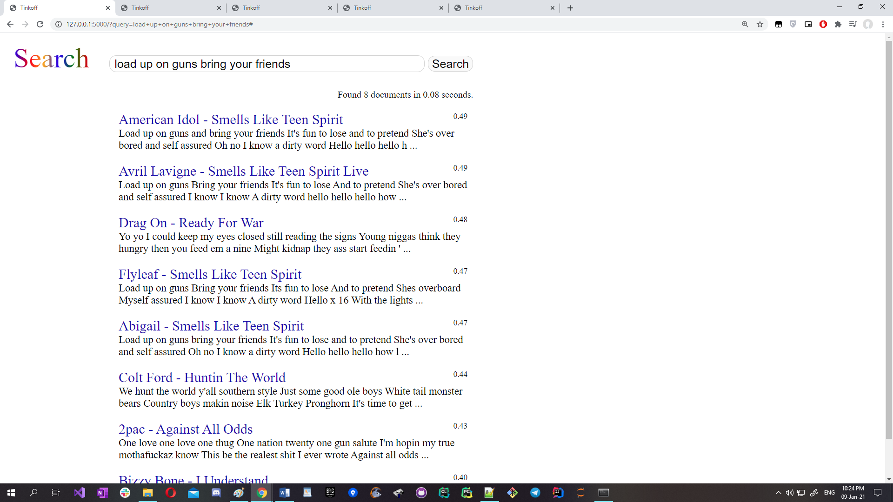

# song-search
 
Поисковая система для нахождения песен по загаловку, автору и содержанию

Фильтрует песни по соответствию содержания запроса и ранжирует подходящие результаты по релевантности. 

Для решения я использовал схожесть эмбеддингов текста песен с запросом через

* для фильтрации - составил обратный индекс

* word2vec для заголовков и автора песни и consine_simularity для score

* tdf-idf  для текста песни

# Скриншоты

# Запуск

Для работы небобходимо установить Python 3 

Запускать с помощью комманды

python "$install-path$/server.py"

где $install-path$ - путь к файлу server.py

открывается сервер на loacalhost, чтобы подключится к нему необходимо ввести в строку браузера сообщение из консоли

"Running on ..."

